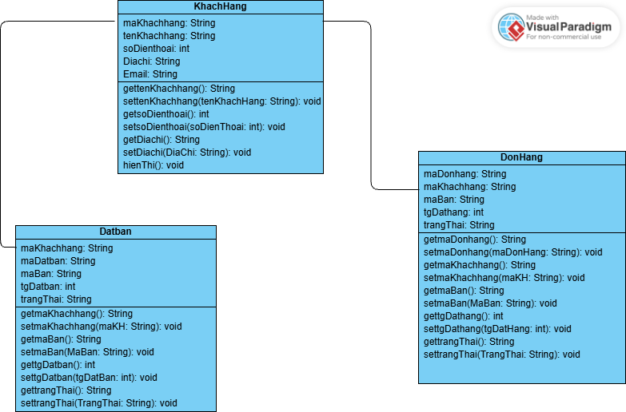
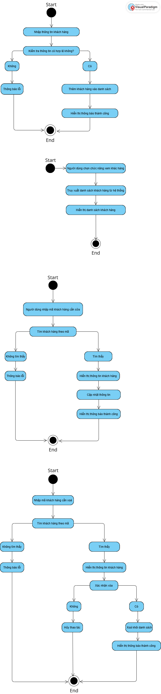

## OOP_N05_T3_2025_Group_Thao.Linh.Cuong
# Ứng Dụng Quản Lý Nhà Hàng
# Đối tượng

1. Nhân viên:mã nhân viên, chức vụ, tên, số điện thoại, địa chỉ,email.
2. Khách hàng:mã khách hàng, tên,số điện thoại, địa chỉ, email.
3. Đặt bàn:mã đặt bàn, mã khách hàng, mã bàn, thời gian đặt bàn, trạng thái.
4. Thực đơn:mã sản phẩm, tên món, mô tả, giá, danh mục.
5. Đơn hàng:  mã đơn hàng, mã khách hàng, mã bàn, thời gian đặt hàng, trạng thái, hình thức đơn hàng( ăn tại quán hay đặt mang về).
6. Chi tiết món trong : mã đơn hàng, mã món có trong thực đơn, số lượng, ghi chú. 
7. Hóa đơn: mã thanh toán, mã đơn hàng, thời gian thanh toán, mã giảm giá, tổng tiền, phương thức thanh toán.
8. Giao hàng: mã giao hàng, mã đơn hàng, địa chỉ giao hàng, thời gian giao hàng, trạng thái đơn hàng.
9. Hàng tồn kho: mã nguyên liệu, tên nguyên liệu, số lượng, ngưỡng đặt hàng lại.
10. Nhà cung cấp: mã nhà cung cấp, tên nhà cung cấp, thông tin liên hệ, địa chỉ.
11. Đơn đặt hàng nguyên liệu: mã đơn đặt hàng, mã nhà cung cấp, ngày đặt hàng, trạng thái. 
12. Feedback: mã phản hồi, mã khách hàng, mã đơn hàng, điểm đánh giá, bình luận.  
Mô tả:
Ứng dụng hỗ trợ nhà hàng quản lý món ăn, bàn ăn và đơn đặt món. Nhằm tối ưu hóa việc phục vụ và kiểm soát hoạt động kinh doanh.
# Thành viên :  
1. Nguyễn Thị Thảo, MSV: 24100357 (Ntthao83053)
2. Vũ Thị Kiều Linh, MSV : 24100542 (ningning1115)
3. Nguyễn Công Cường. MSV : 24100285 (NCC24100285)
4. Nguyễn Lệ Thu (nglthu1979)
# Sơ đồ chức năng

# Sơ đồ thuật toán
1. Sơ đồ đặt bàn

2. Sơ đồ khách hàng

3. Sơ đồ đơn hàng

Câu 1 
Tiêu đề bài tập lớn cuối kỳ của nhóm:

Ứng dụng Quản lý Nhà hàng

Câu 2
Khách hàng:mã khách hàng, tên,số điện thoại, địa chỉ, email.
Đơn hàng:  mã đơn hàng, mã khách hàng, mã bàn, thời gian đặt hàng, trạng thái, hình thức đơn hàng( ăn tại quán hay đặt mang về).
Đặt bàn:mã đặt bàn, mã khách hàng, mã bàn, thời gian đặt bàn, trạng thái.

Hành vi: tạo đơn đặt món, thêm món vào đơn, thay đổi trạng thái đơn (chờ xử lý, đã thanh toán...).

Câu 3 
Link GitHub repo chứa cấu trúc folder của dự án nhóm:
https://github.com/Ntthao83053/OOP_N05_T3_2025_Group_Thao.Linh.Cuong

Cấu trúc thư mục ví dụ:

/quan-ly-nha-hang
  /src
    /models         ← các class đối tượng chính
    /tests          ← kiểm định/test
  README.md
  App.java
Câu 4 
Các class đã viết /src:

KhachHang.java
Datban.java
DonHang.java

Câu 5 
Các class kiểm định đã viết trong /src/tests:

testKhachHang.java
TestDatban.java
TestDonhang
Câu 6 
Link đến README.md đã cập nhật đầy đủ thông tin:

# Repo của nhóm : 

https://github.com/Ntthao83053/OOP_N05_T3_2025_Group_Thao.Linh.Cuong
